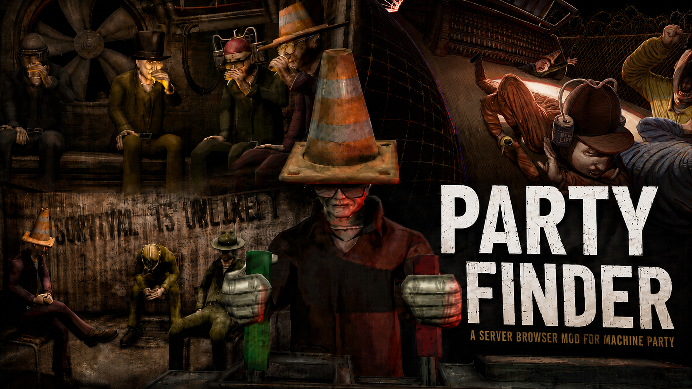
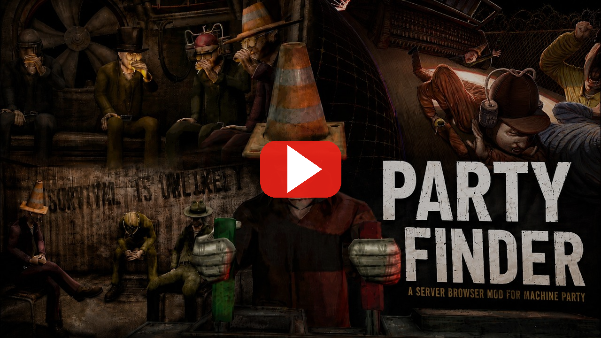

<h1 align="center">Party Finder</h1>

<p align="center">
  
</p>

**Party Finder is a server browser mod for Machine Party.**

Party Finder is a server browser for **Machine Party**. It adds a global, non region locked list of public lobbies on top of the game's existing Steam networking, so you can find and join games with strangers instead of only playing with friends. It does not change how the base game's networking works. It only adds to it.

Created by **J_axon**.

> **Credit required.** You are free to use Party Finder's code in your own projects under the MIT License. If you reuse any of it, you must credit **J_axon** and keep the license notice included. Please keep that credit visible and easy to find, for example in your README, mod description, or in game credits.

---

## What is included

- A **server browser** that replaces the main menu JOIN button.
- A **Make Lobby Public** toggle on the host's lobby screen (private by default).
- A **lobby setup popup** for naming your lobby and choosing a max player count.
- A **join by room ID code** field for private lobbies (the same 18 digit code the base game already uses).

Everything is built with the game's own font and styled as a green terminal theme, so it fits the look of Machine Party.

---

## How it works

Machine Party already runs on Steam lobbies, but every lobby the base game creates is friends only, so lobbies never show up in a public search. Party Finder changes that in a safe, additive way:

- When you make your lobby public, Party Finder flips your existing Steam lobby to a public type and tags it with a small amount of lobby data (name, max players, game version, host name). Turning it private again restores the friends only default.
- The browser asks Steam for a worldwide list of lobbies that carry Party Finder's public tag, then reads each one's data to show its name and player count.
- Joining a lobby reuses the game's own client join flow, exactly the same path the game uses when you accept a Steam invite. Nothing about the underlying connection changes.

Party Finder is a pure GDScript mod loaded through the Machine Party Mod Loader. It does not repack or modify the game's data file.

---

## Works with vanilla players

Party Finder is fully cross compatible with players who do **not** have the mod. You do not both need it installed to play together.

- If you host with the mod active, you can still give your room ID code to a vanilla player and they can join and play with you completely normally.
- It works the same the other way around: with the mod, you can paste a vanilla host's room ID code and join their game just fine.
- Public lobbies only appear in the browser for people who also have the mod, but anyone can still join by room ID code.

The only difference for mod players is that the in game invite button does not work (a Steam overlay limitation of the mod loader), so mod players just share the room ID code instead.

---

## Everything you can do

**From the main menu**

- Press **JOIN** to open the server browser.
- See a live list of public lobbies from around the world, each showing the lobby name and current players out of the max.
- Press **REFRESH** (top right) to re fetch the list at any time.
- Press a lobby's **JOIN** button to join it. Full or version mismatched lobbies are shown but cannot be joined.
- Paste an 18 digit room ID code into the **ROOM ID** field and press **JOIN** to join a private lobby directly. The **PASTE** button fills the field from your clipboard.
- Press the **X** (top left) or **BACK** to close the browser.

**When hosting**

- Host a game as normal. On the lobby screen you will see a **MAKE LOBBY PUBLIC** button next to the existing lobby buttons. It uses the game's native button style.
- Press it to open the setup popup, where you can:
  - Type a **lobby name**.
  - Set the **max players** using the up and down arrows. The limit is **4** and the mod will not let you go higher.
- Confirm to publish. Your lobby now appears in everyone's browser.
- Press the button again to switch your lobby back to **private** at any time. It works as a simple on and off switch.

Private lobbies still work exactly like the base game. Share your room ID code with a friend and they can paste it into the browser to join.

---

## Installation

### Prefer to watch instead of read?

Use this video if you would rather watch than read the steps below.

<p align="center">
  <a href="https://www.youtube.com/watch?v=bKLGPkOzQ7Y&t=4s">
    
  </a>
</p>

<p align="center"><a href="https://www.youtube.com/watch?v=bKLGPkOzQ7Y&t=4s"><b>&#9654; Watch the install video on YouTube</b></a></p>

Party Finder runs through the **Machine Party Mod Loader**, so you install that once, then drop Party Finder into the mods folder. Everyone who wants to browse or host public lobbies needs both. A friend can still join your private lobby by room ID code without either.

### Step 1: Install the Machine Party Mod Loader

1. **Find your game folder.** In Steam, right click **Machine Party** in your library, choose **Manage**, then **Browse local files**. The folder that opens (the one containing the game `.exe`) is your game folder.
2. **Download the installer.** Open the mod loader's releases page and grab **Machine_Party_Mod-Loader_Installer.exe** from the latest release:
   https://github.com/machine-party-modding/Machine-Party-Mod-Loader-Installer/releases
3. **Run the installer.** When it asks for your game folder, paste or select the folder from step 1 (the one with the game `.exe`), for example:
   ```
   C:\Program Files (x86)\Steam\steamapps\common\party project\Machine Party_Windows
   ```
4. **Finish.** It creates a **Machine Party Modded** shortcut in your Start menu (press the Windows key and search for it). This shortcut is the only way to launch modded. Launching any other way gives you a normal, unmodded game.
5. **Verify it installed.** Your game folder should now contain a **mods** folder and a **Machine Party__modded.pck** file. If they are missing, you pointed the installer at the wrong folder. Run it again with the correct game folder.

### Step 2: Install Party Finder

1. Download **Jaxon-PartyFinder.zip** from the Party Finder releases page:
   https://github.com/Ghostx10742/MachineParty-PartyFinder/releases
2. Put the zip (do **not** unzip it) into the **mods** folder inside your game folder:
   ```
   <your Machine Party folder>\mods\Jaxon-PartyFinder.zip
   ```

### Step 3: Launch and play

1. Start the game from the **Machine Party Modded** shortcut, not the normal Play button.
2. First launch only: if the loader asks to restart, do **not** use the in game restart button. Fully close the game and reopen it from the **Machine Party Modded** shortcut. The in game restart button, for some reason, does not properly load in the mods you have if they are freshly installed.
3. On the main menu, press **JOIN** to open the server browser. To host a public game, start a lobby and press **MAKE LOBBY PUBLIC**.

To uninstall Party Finder, delete Jaxon-PartyFinder.zip from the mods folder. To play vanilla again, just launch from the normal Steam Play button.

### Still not working?

If you installed everything correctly and Party Finder still does not show up, close the game completely and launch it again from the **Machine Party Modded** shortcut. Freshly installed mods sometimes need one extra restart. If it still does not appear, super double check every step above, especially that **Jaxon-PartyFinder.zip** is inside the **mods** folder and that you launched from the **Machine Party Modded** shortcut and not the normal Steam Play button.

---

## Notes

- The Steam overlay (Shift and Tab), and the invite button, do not work while the game runs through the mod loader. This is a mod loader limitation, not a Party Finder issue. The browser and room ID copy and paste cover joining without it.

---

## Game updates

Party Finder runs on top of the Machine Party Mod Loader, so a future Machine Party update can temporarily break the mod loader (and with it, this mod). If that happens, the modded shortcut may fail to launch or your mods may stop loading.

If it does, do not panic and do not keep reinstalling. Just wait until the mod loader pushes an update that fixes it, then update the mod loader and launch again. Your normal, unmodded game is never affected and always launches fine from the standard Steam Play button.

---

## Building from source

Party Finder is pure GDScript, so there is no compile step. Building just means packaging the mod folder into a zip that the Machine Party Mod Loader can read.

Requirements: git, and Python 3 (used only to package the zip).

1. Clone the repo:
   ```bash
   git clone https://github.com/YOUR-USERNAME/MachineParty-PartyFinder.git
   cd MachineParty-PartyFinder
   ```
2. Build the zip:
   ```bash
   python build.py
   ```
   This writes `dist/Jaxon-PartyFinder.zip`, laid out as `mods-unpacked/Jaxon-PartyFinder/...`, which is the structure the mod loader expects. A prebuilt copy is already in `dist/` if you just want to install it.
3. Install it for testing: copy `dist/Jaxon-PartyFinder.zip` into your game's `mods` folder, then launch from the "Machine Party Modded" shortcut (see the Installation section above).

Dev loop: edit the GDScript in `Jaxon-PartyFinder/`, run `python build.py`, copy the new zip into the game `mods` folder, and relaunch from the modded shortcut. If a change to which methods are hooked triggers a first launch restart prompt, quit fully and relaunch from the shortcut.

Repo layout:

```
Jaxon-PartyFinder/   the mod source (manifest.json, mod_main.gd, server_browser.gd, ui/)
dist/                the built, ready to install zip
assets/              readme banner image
build.py             packages the mod into dist/
```

---

## Credits

- Created by **J_axon**.
- Minor thanks to **Kokiix**, creator of the Machine Party Mod Loader fork of GodotModding's godot mod loader, which Party Finder is loaded through.

---

## License

Party Finder is released under the **MIT License**. You are free to use, modify, and include this code in any project, including your own mods, for free. The one requirement is that you keep the credit to **J_axon** (the copyright and permission notice from the LICENSE file) included with the code. Please also credit J_axon somewhere visible in any project that reuses it. See the LICENSE file for the full terms.

---

## AI disclosure

AI was used during the development of this project, mainly for revisions, inquiries, and things I just did not know. This does not mean the mod was fully AI-made, but rather that AI was used as part of the development process. I wanted to disclose this for people who may have a problem with AI being involved and may not want anything to do with it. Even though I disagree with your view on AI, I still respect your opinion on the subject.
